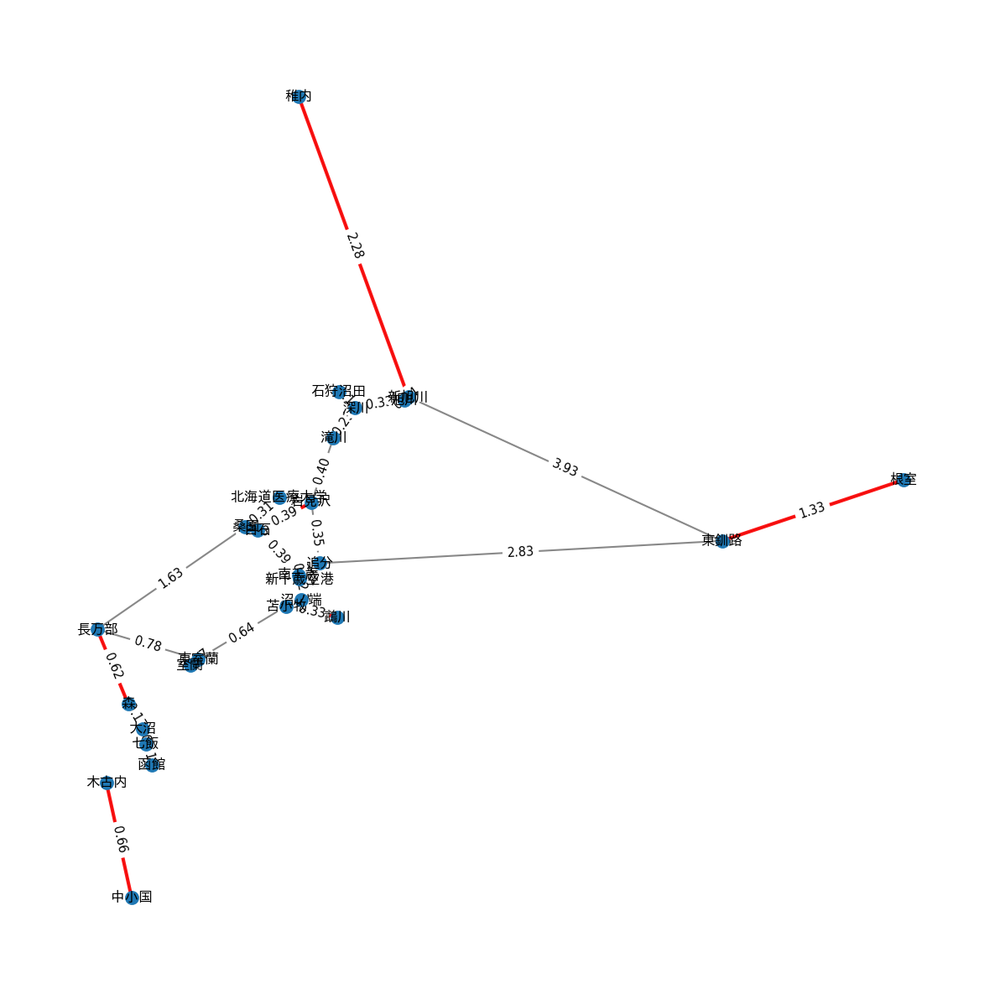

# complete_riding

## 概要

`complete_riding` は日本の鉄道駅データを用いて路線グラフを構築し、
キー駅（接続駅・終端駅）に基づく縮約グラフや、完全被覆（完乗）に関わる最短距離計算を行うためのツール群です。

主な処理は Python スクリプトで構成されており、以下の機能を備えます。

- 駅・路線データの前処理（特定事業者の路線抽出など）
- 路線グラフの可視化（`matplotlib`/`networkx`）
- キー駅（分岐・終端）抽出と縮約隣接行列の作成
- 最小完全マッチング等に基づく経路計算（`cpp.py` の CPP 実装を利用）

このリポジトリは実験的な解析や可視化を目的としており、`rsc/` にある CSV データを読み込んで処理します。
[駅データ.jp](https://ekidata.jp/)から下記データをダウンロードし、`rsc/` に配置してください。
- 路線データ
- 駅データ
- 接続駅データ

## 必要条件

- Python 3.10 以上（PEP 604 の `|` 型注釈等を使用しているため）
- pip でインストール可能な Python パッケージ:
  - pandas
  - numpy
  - networkx
  - matplotlib
  - japanize_matplotlib

依存パッケージは次のようにインストールできます:

```bash
python -m pip install --upgrade pip
pip install pandas numpy networkx matplotlib japanize_matplotlib
```

（必要に応じて `pyproject.toml` の設定に従って仮想環境で作業してください。）

## フォルダ構成（抜粋）

- `src/` : メインのスクリプト群（`generate_map.py`, `line_cpp.py`, `cpp.py`, `visualize.py` 等）
- `rsc/` : 入力となる元データ CSV
- `output/` : スクリプトが出力する CSV（縮約隣接行列やキー駅リストなど）
- `test/` : ユニットテスト

## 使い方

以下は代表的なワークフローです。

1) 路線データの前処理と縮約行列の作成・可視化

`generate_map.py` はデータを読み込み、指定した事業者（company_cd）に対応する駅・接続情報を抽出し、
キー駅の抽出、縮約隣接行列の保存を行います。

デフォルトは JR 北海道（`company_cd=1`）です。会社コードを指定して他社を処理できます。

例: JR 北海道（デフォルト）を実行

```bash
python src/generate_map.py
```

例: 会社コードを指定して実行（例: `--company-cd 2`）

```bash
python src/generate_map.py --company-cd 2
```

特定の路線コードを除外したい場合はカンマ区切りで指定できます。

```bash
python src/generate_map.py --company-cd 1 --exclude-lines 11118,12345
```

実行後、`output/` に次のようなファイルが作られます（プレフィックスは会社や指定により変わります）:

- `{prefix}_adjmatrix.csv` : 縮約隣接行列（行・列ラベルはキー駅の `station_cd`）
- `{prefix}_stations.csv` : キー駅リスト（`station_cd`, `station_name`, `lon`, `lat` など）

2) 縮約行列を用いた最短経路／完乗推定（CPP）

`line_cpp.py` は `generate_map.py` が出力した CSV を読み込み、
`cpp.py` のアルゴリズム（Complete Postman Problem に関連した処理）を実行します。

`--prefix` 引数で読み込むファイルのプレフィックスを指定してください（デフォルトは `company_1_key_stations`）。

例:

```bash
python src/line_cpp.py --prefix company_1_key_stations
```

このスクリプトは最小完全マッチングのペアを標準出力に表示し、可視化を行います（`Visualizer` を利用）。

## テスト

テストは `pytest` を使って実行できます。リポジトリルートで次のコマンドを実行してください。

```bash
pytest -q
```

（テストは小規模で、内部の `CPP` 実装やユーティリティ関数を検証します。）

## 開発メモ / 注意点

- スクリプトは `rsc/` にある CSV のスキーマに依存しています。別のデータセットを使う場合は列名や ID の対応を確認してください。
- `generate_map.py` の `preprocess_company` 関数を利用すれば、任意の `company_cd` に対して同様の前処理が可能です。
- 型注釈（`list[int] | None` など）を使用しているため、Python 3.10 以上を推奨します。

## 追加の作業候補

- 出力ディレクトリやファイル名のさらなるパラメータ化
- 大きなデータセットに対する処理高速化（並列化や外部 DB の利用）
- 可視化結果の画像保存オプション

---

この README に追加してほしい項目や、実行環境の細かい指定（仮想環境の設定例や `pyproject.toml` を使ったインストール手順）があれば教えてください。

## 実行例: `line_cpp.py`

次は `generate_map.py` で作成した縮約隣接行列を `line_cpp.py` に入力して実行した例です。以下は実行時の標準出力と、スクリプトが保存した可視化画像です。

```bash
python src/line_cpp.py --prefix company_1_key_stations
```

出力（例）:

```
最小完全マッチングのペア:
桑園 - 北海道医療大学: 0.3058777263947944
函館 - 長万部: 1.0080534728956323
新旭川 - 稚内: 2.283603223440215
苫小牧 - 鵡川: 0.3346339343062593
深川 - 石狩沼田: 0.1434709074741728
東釧路 - 根室: 1.3324016187288827
白石 - 岩見沢: 0.3886020623060033
沼ノ端 - 新千歳空港: 0.19228600045904443
室蘭 - 東室蘭: 0.0653342944813128
中小国 - 木古内: 0.6625986349568734
全エッジの重み合計 + 最小完全マッチングの重み合計 = 25.587749660000423
Saved visualization to: output/images/company_1_key_stations_line_cpp_selected_pairs.png
```

可視化画像:



出力の見方

- 本解析の目的は「完乗（すべての辺を少なくとも一度通る）」に必要な最短距離を求めることです。
- `最小完全マッチングのペア:` は、完乗で2回通過する必要のある駅間ペアを示します（各行は「駅A - 駅B: 距離」）。
- `全エッジの重み合計 + 最小完全マッチングの重み合計`: グラフ上の全辺を1回ずつ通る距離（全エッジの重み合計）に、往復が必要な部分を埋めるための最小追加距離（最小完全マッチングの重み合計）を加えた値で、これが完乗に必要な最短距離になります。

- 距離値の注意: 現状は `lon/lat` を用いたユークリッド距離（度数表現）を使っています。実距離（m/km）が必要な場合はハヴァーシン等で変換してください。
 - `Saved visualization to:`: 可視化画像の保存先パスを示します（README 内の埋め込みは相対パス）。

可視化画像の見方
 - ノード: 駅（駅名ラベルあり）。座標が与えられていれば経度/緯度をそのまま座標としてプロットしています。
 - 薄い灰色の辺: 縮約隣接行列や距離行列に基づくベースの辺。
 - 赤色（太線）: `line_cpp.py` 出力で選ばれたペアに対応する経路上の辺をハイライトしています（ペアが直接接続していない場合はその最短経路上の辺がハイライトされます）。
 - 破線: グラフ上で到達不可能なペアに対して、ノード座標を直接結んだ破線（視覚的補助）です。
 - エッジラベル: 辺の重み（距離）を小数点で表示しますが、単位は上記と同様に度数表現です。

注意
 - 現在の距離計算は簡易的で、地球上の実距離を正確に反映しません。正確な距離（メートル/キロメートル）を求める場合はハヴァーシン（Haversine）等で変換してください。
 - 可視化では `plt.show()` も呼ばれるため、対話環境ではウィンドウ表示されます。非対話（CI等）で画像だけ生成したい場合は `visualize.py` に `show=False` オプションを追加できます（必要なら実装します）。


## 参考にした記事

以下の記事を本プロジェクトの実装・設計の際に参考にしました。実装方針やアルゴリズム、可視化手法の理解に役立っています（各記事の著者に感謝します）。

- 【競技プログラミング】中国人郵便配達問題をやってみた【組合せ最適化 — Qiita
  - 概要: 最小完全マッチングや Eulerian path に関する考え方、CPP に関する解説がまとまっています。本リポジトリの `cpp.py` の実装やアルゴリズム選定の参考にしました。
  - URL: https://qiita.com/kindamu24005/items/f87956efac5bd43aabbb

- 
鉄道路線データを可視化し、最短経路問題を解く (Python+Pandas+NetworkX) — Qiita
  - 概要: 鉄道路線データの前処理・`networkx` と `matplotlib` を用いた可視化手法の具体例が示されています。`generate_map.py` / `visualize.py` の実装方針や表示のアイデアを参考にしました。
  - URL: https://qiita.com/galileo15640215/items/d7737d3e08c7bb3dba80
